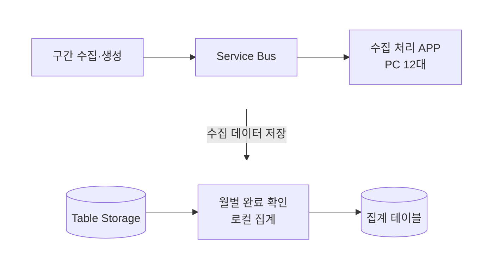
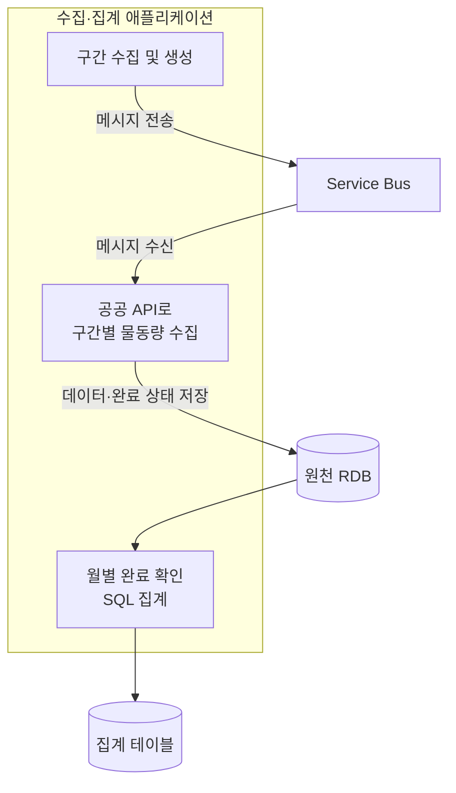
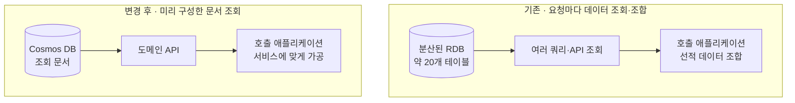
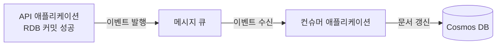
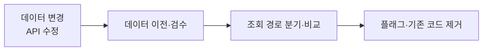
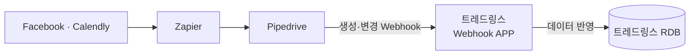
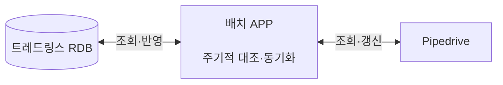

# 이도훈 포트폴리오

## 자기소개

Java·Spring Boot를 주로 사용하는 백엔드 개발자입니다. 물류 서비스에서 외부 데이터 연동과 서비스 기능 개발을 맡으며, 출시 이후의 유지보수와 운영까지 경험해 왔습니다.

### 개발 이후의 운영까지 맡으며 개선점을 찾습니다.

서비스를 지속적으로 운영하면서 외부 시스템의 변경이나 데이터 누락이 고객의 업무 지연으로 이어지는 상황을 겪었습니다. 이 경험을 통해 기능이 정상적으로 동작하는 것뿐 아니라, 문제를 알아차리고 복구할 수 있는 과정도 개발의 중요한 부분으로 생각하게 됐습니다.

### 실제 업무에서 반복되는 불편을 줄이는 데 관심이 있습니다.

운영자와 마케팅·영업 담당자가 데이터를 확인하고 옮기는 과정을 보며, 반복 작업을 줄이는 것도 서비스 개선의 한 부분임을 배웠습니다. 업무의 처리 기준과 사람이 확인해야 할 상황을 이해하고, 이를 개발에 반영해 담당자가 같은 확인과 수정을 반복하는 부담을 줄이고자 합니다.

### 변경의 이유와 영향을 관계자들과 함께 맞춥니다.

상품이나 이용 정책을 바꾸는 작업에서는 개발 범위뿐 아니라 기존 고객의 사용 방식과 운영 일정도 함께 고려해야 했습니다. 변경에 필요한 이유와 범위를 설명하고, 유지해야 할 조건과 확인 방법을 팀원·기획·운영 담당자와 맞추며 작업합니다.

## 기술 스택

- 백엔드: Java, Spring Boot, Spring Framework, JPA, QueryDSL, MyBatis
- 데이터: RDB(MSSQL, MariaDB), NoSQL(Cosmos DB), Azure Table Storage
- 데이터 연동: REST API, Webhook, EDIFACT, Azure Service Bus
- 인프라·개발 도구: Azure VM, Azure Blob Storage, Kubernetes, Docker, Azure DevOps, Git, Gradle, Maven

## 주요 프로젝트

1. 물동량 데이터 수집·집계 구조 개선
2. 선적 데이터 통합을 위한 CQRS 전환과 DB 이전
3. 광고 상품 출시를 위한 모델 재설계와 성과 집계 정비
4. CRM 리드 등록 자동화와 고객 데이터 동기화
5. 선사·터미널 스케줄 수집 및 연동
6. 플랜별 기능 제어 공통화와 기존 사용자 이용 조건 유지

**유지보수 / 운영:** 링고 · 화이트라벨 · OV 선박명 개선 · 정시성 데이터 제공 · 배포 환경·서비스 통신 · 개발 작업 자동화

---

## 01. 물동량 데이터 수집·집계 구조 개선

**기간:** 2024.03–2025.08
**담당:** 수집·집계 구조 설계, 구현, 검증 및 운영 단독 담당

### 문제: 웹 수집의 중단이 서비스 데이터 갱신에 미치는 영향

사업자등록번호·품목·컨테이너 단위·이용 선사 등의 물동량 데이터를 수집해 트레드링스의 광고 플랫폼인 링고와 외부 업체에 제공했습니다. 데이터 수집하는 홈페이지 구조가 변경되어 크롤러를 새로 개발해야 했습니다.

수집 누락으로 링고에서 특정 포워더·선사의 물동량이 갱신되지 않았으며, 외부 업체에 약속한 데이터 제공 일자를 맞추는 데도 문제가 발생하였습니다.

### 판단과 구현

#### 1차: 크롤러 신규 개발과 수집 환경 조정

수집 작업은 기간·입항코드·호출부호(콜사인) 등의 조건을 조합한 구간으로 나눴습니다. 중단된 구간은 다시 수집해야 했지만, 구간을 지나치게 작게 나누면 전체 처리 시간이 늘어나는 제약이 있었습니다. 이를 고려해 재수집 범위와 전체 처리 시간을 함께 조절할 수 있도록 수집 구간을 나눠 설계했습니다.

수집 구간 정보는 작업을 배정하고 처리하는 동안만 필요한 일시적인 데이터였습니다. 이를 RDB에 저장하고 조회·상태 갱신·삭제하는 구조 대신, Azure Service Bus의 메시지로 전달하도록 구성했습니다. 각 PC는 큐에서 작업을 받아 해당 구간을 수집하도록 해 여러 PC에 작업을 분배했습니다.

신규 크롤러를 개발하면서 CAPTCHA와 IP 차단에도 대응했습니다. CAPTCHA 이미지의 숫자를 인식하는 모델을 개발해 수집 과정에 적용했습니다. 개발 환경에서는 동작했지만 Azure VM·VPN을 사용한 환경에서 접근이 차단되는 것을 확인했고, 인터넷 동글을 활용해 네트워크 환경을 구성한 뒤 PC 12대에서 수집하도록 했습니다.

구간별 작업 처리는 가능해졌지만, 웹 화면 변경과 접근 차단에 계속 대응하고 수집량을 수동으로 확인해야 하는 운영 부담은 남았습니다.

#### 2차: 필요한 데이터의 제공 여부를 확인하고 공공 API로 전환

필요한 데이터가 공공 API로 공개된 것을 확인하고, 기존 수집 결과와 제공 범위·누락 여부를 비교했습니다. 운영 환경 전환 시 호출 한도가 확대되는 조건도 검토했습니다.

웹 화면 변경과 접근 차단에 따른 운영 부담을 줄이기 위해 공공 API로 전환했습니다. VM 1대에서 API 기반 수집을 운영하되, 허용 호출량에 맞춰 수집 인스턴스를 늘려 처리량을 조절할 수 있도록 설계했습니다.

#### 수동 집계를 RDB 기반 배치로 변경

기존에는 로컬에서 구간을 생성하고, PC가 수집한 데이터를 Azure Table Storage에 저장했습니다. 월 단위 수집 완료를 수동으로 확인한 뒤 로컬 집계 프로그램에서 데이터를 두 단계로 가공했습니다.

SQL 집계와 수집 상태 관리를 위해 원천 저장소를 RDB로 변경했습니다. 월별 수집 조건을 RDB에 저장하고, 구간의 수집이 끝날 때마다 완료 상태를 갱신했습니다. 정상 응답에 데이터가 없는 구간도 완료 처리하되, 실패하거나 데드레터 큐에 남은 구간이 있으면 해당 월의 집계를 시작하지 않았습니다.

일 배치가 월별 전체 구간의 완료 여부를 확인한 뒤 SQL로 집계 테이블을 갱신하도록 했습니다. 유지보수 부담을 줄이기 위해 구간 생성·수집·완료 확인·집계를 하나의 애플리케이션에 구성했습니다.

#### 호출 한도와 데이터 오류를 구분한 재처리

API 전환 후에도 호출 한도로 수집이 중단될 수 있어, 구간별 작업 메시지를 Service Bus 큐에 전송하고 수집 애플리케이션이 받아 처리하는 구조를 유지했습니다. 호출 한도를 초과하면 수집을 중지하고, 한도가 초기화되는 시점에 애플리케이션 스케줄러로 재개했습니다.

저장 실패 시 메시지를 완료 처리하지 않았고, 같은 작업이 다시 실행되면 복합 키로 기존 데이터를 식별해 갱신하도록 했습니다. 반복 실패로 데드레터 큐에 이동한 메시지는 Slack으로 알렸습니다. API 스펙과 다른 데이터 등 실패 원인을 확인하고 코드를 수정한 뒤, 데드레터 큐의 메시지를 원래 큐로 다시 보내 해당 구간을 재수집했습니다.

### 구성도

#### 수집·집계 흐름

두 그림은 작업 메시지와 수집 데이터가 처리되는 순서입니다. 수집 처리 APP이 Service Bus의 메시지를 읽어 해당 구간을 수집합니다.

**1차: PC 기반 웹 수집 · 수동 완료 확인과 집계**

**2차: 공공 API 기반 수집 · 완료 확인과 집계 자동화**

### 결과와 남은 제약

- 일평균 수집·저장을 처리한 구간 수: 약 1.8만 개 → 4.5만 개
- 동일 크기 구간의 재수집·저장 완료 시간: 1분 이상 → 약 5초
- 2차 전환의 운영 환경: PC 12대 → VM 1대
- 한 달치 데이터 수집 완료 기간: 약 30일 → 15일

공공 API 전환과 수집·집계 개선을 함께 적용한 결과입니다. 다만 제공 기관으로부터 실제 허용 사용량이 포털 안내 수준보다 적다는 안내를 받아 외부 호출 한도의 제약은 남았습니다.

---

## 02. 선적 데이터 통합을 위한 CQRS 전환과 DB 이전

**기간:** 2026.03–2026.05
**개인 담당:** 조회 API 구현, 공통 PK를 활용한 AI 검수 방식 제안
**팀 공동 작업:** 구조 설계, 데이터 검수 방법 논의

### 문제: 분산된 선적 데이터와 조회 로직의 변경 부담

회사는 BL·컨테이너·부킹의 선적 정보를 하나의 화면에서 제공하는 방향으로 제품을 확장하고 있었습니다. 그러나 선적 데이터가 서로 다른 DB에 분산되어 있었고, 기존 BL 정보 조회에는 약 20개 테이블에 대한 여러 쿼리와 API 응답 조합이 필요했습니다.

데이터별 모듈이 나뉘어 있어 공통 모듈을 수정할 때 이를 사용하는 여러 애플리케이션의 영향을 함께 고려해야 했습니다. 같은 데이터를 중복 조회하거나 같은 애플리케이션의 다른 API를 반복 호출하는 경우도 있었습니다. 이러한 제약을 해결하고 분산된 선적 데이터를 하나의 조회 구조로 통합하기 위해, 선적 데이터를 새로운 DB로 이전하면서 조회 모델을 통일하는 작업을 진행했습니다. 이를 통해 DB 부하와 변경 영향 범위를 줄이고자 했습니다.

### 판단과 구현

#### BL 조회 문서를 제공하는 API 구현

팀에서는 이미 적용 중이던 인덱스·SQL·캐시 개선에 더해, 여러 데이터를 조회·조합하는 구조 자체를 정리하기로 했습니다. 쓰기와 조회 모델을 분리하고, BL 관련 데이터를 하나의 조회용 문서로 통합해 기존에 사용하던 NoSQL 데이터베이스인 Cosmos DB에 저장했습니다.

저는 이 문서를 제공하는 조회 API를 구현했습니다. 선적 데이터를 관리하는 도메인 애플리케이션이 문서를 제공하고, 호출 애플리케이션은 받은 문서를 서비스에 맞게 가공하도록 조회 경로를 구성했습니다.

#### 공통 PK를 활용한 데이터 검수 방식 제안

팀원들은 백만 건이 넘는 데이터를 사람이 모두 확인하기 어렵다는 점을 인지하고 있었습니다. 저는 기존 RDB·변경된 RDB·Cosmos DB의 데이터를 공통 PK인 UUID로 대조하는 검수에 AI 에이전트를 활용하는 방식을 제안했습니다.

팀에서는 UUID를 기준으로 누락 문서와 항목별 불일치를 비교하고, 차이가 있는 데이터를 재처리한 뒤 다시 확인했습니다.

#### 팀의 데이터 갱신 구조와 이전 절차

최종적 일관성(Eventual Consistency)을 전제로 조회 문서를 갱신하는 구조를 선택했습니다. 수집과 문서 갱신에 걸리는 시간이 짧아 사용자가 불편을 느낄 정도의 지연은 아니라고 판단하였기 때문입니다.

이에 따라 API에서 RDB 트랜잭션을 완료한 후 메시지 큐에 이벤트를 발행하고, 별도로 구동하는 컨슈머가 이벤트를 받아 Cosmos DB의 조회 문서를 갱신하도록 구성했습니다. API와 컨슈머는 같은 프로젝트에 구현했으며, 데이터 등록과 조회 문서 반영을 분리해 조회 성능과 처리 흐름을 단순화했습니다.

이전 중 신규·수정 데이터는 구·신 DB 양쪽에 반영했습니다. 팀에서는 이전·검수 후 피처 플래그로 기존·신규 조회 경로의 결과를 비교하고, 플래그와 기존 코드를 제거했습니다.

### 구성도

#### 조회 구조 변화

#### 이벤트를 통한 조회 문서 갱신

#### 팀의 DB 이전과 조회 경로 전환

### 결과와 기여

같은 API·데이터·조회 환경에서 비교한 평균 응답 시간이 약 1,000ms에서 500ms로 감소했습니다. 약 20개 테이블에 대한 조회·조합을 Cosmos DB 문서 조회로 단순화했고, 도메인 애플리케이션으로 데이터 갱신과 문서 제공 책임을 모았습니다.

---

## 03. 광고 상품 출시를 위한 모델 재설계와 성과 집계 정비

**기간:** 1차 2024.08–2024.09 / 2차 2026.02–2026.03
**담당:** 광고 백엔드, 모델·테이블 변경, API·백오피스 및 마이그레이션

- **1차:** 가로형·세로형 배너 상품과 백오피스 출시 — 생성·조회·수정·삭제 및 집계 기능
- **2차:** 독점형 상품 추가, 상품 모델 재정의, UTC·KST 집계 버전 관리

### 문제: 기존 상품을 유지하면서 새로운 묶음 상품을 판매해야 하는 요구

2024년 광고 상품을 처음 출시한 뒤, 2026년에는 기존 상품을 개별 판매하면서 두 상품을 묶은 신규 상품도 판매하려는 요구가 생겼습니다. 기존에는 상품 자체가 배너의 노출 위치를 의미해, 한 상품에 여러 배너 위치를 묶기 어려웠습니다.

### 판단과 구현

#### 기존 상품과 묶음 상품을 함께 운영할 수 있도록 모델 변경

판매 상품과 배너 타입을 분리하고, 한 상품에 여러 배너 타입을 직접 연결할 수 있도록 관계를 재설계했습니다. 기존 가로형·세로형 상품은 각각의 배너 연결을 유지하고, 독점형 상품에는 가로형·세로형 배너를 함께 연결했습니다.

이 관계에 맞춰 모델과 테이블을 변경하고, 상품과 구성 요소를 관리하는 API와 백오피스를 구현했습니다.

#### 기존 API를 유지하며 단계적으로 전환

V1 API 수정과 테이블·스키마 변경 → V2 API 구현 → 불필요한 스키마 삭제 순서로 작업했습니다. 기존 V1 코드도 변경된 데이터 구조와 일관되게 동작하도록 수정하고, API 호출 테스트와 내부 운영자의 협조를 통해 전환을 확인했습니다.

### 광고 운영 중 성과 집계 정비

#### 비정상적인 노출과 반복 요청을 집계에서 제외

방문자가 적은 명절·휴일에도 비정상적인 노출 수가 기록되는 것을 확인했습니다. User-Agent에 `bot`이 포함된 요청과 알려진 봇의 식별 패턴을 기준으로 Googlebot·Bingbot 등의 검색 봇 요청을 집계에서 제외했습니다. 또한 30분간 유지되는 쿠키를 발급하고, 같은 쿠키값으로 일정 횟수를 초과한 요청이 들어오면 집계에서 제외하도록 했습니다.

#### 2차: UTC·KST 집계 버전 관리

2차 작업에서는 한국 시간(KST, UTC+9) 기준으로 성과를 제공해야 했지만, 기존 집계는 UTC를 기준으로 동작했습니다. 기존 UTC 기준 집계를 유지하면서 한국 시간(UTC+9) 기준 집계를 추가해, 실무자가 고객사 요청에 따라 두 기준의 데이터를 제공할 수 있도록 구성했습니다.

### 결과

기존 상품을 유지한 채 묶음 상품을 판매할 수 있도록 했으며, UTC·한국 시간 기준 두 가지 버전의 성과를 제공할 수 있게 했습니다. 기획 단계에서 변경 범위와 개발 기간을 설명하고 일정에 반영해 상품 출시 지연 없이 진행했습니다.

신규 상품 출시 직후 광고 계약이 발생하였습니다.

**변경 이후 운영 규모:** 신규 광고 구좌 4개, 광고주 약 5개, 일평균 노출 약 25,000회.

---

## 04. CRM 리드 등록 자동화와 고객 데이터 동기화

**기간:** 2025.05–2025.07 · 주요 구현 약 1개월, 이후 필드 추가 및 연동 정보 변경 대응
**담당:** Zapier 기반 외부 채널 연동, Pipedrive Webhook 처리, 내부 DB와 CRM의 데이터 동기화

### 문제: 외부 유입 정보를 매일 수동으로 CRM에 등록

마케팅팀은 Calendly로 접수된 문의와 Facebook 설문 응답을 매일 엑셀로 정리한 뒤, 사용 중이던 CRM인 Pipedrive에 고객 정보와 영업 기회 정보를 직접 등록했습니다. 이 과정에서 반복적인 입력 작업이 발생했고, 같은 고객을 중복 등록할 수 있었습니다. 영업팀과 마케팅팀의 요청에 따라 외부 유입 정보의 등록을 자동화하고 내부 회원 정보와 CRM 데이터를 연결했습니다.

### 판단과 구현

#### 외부 문의 등록 자동화

외부 채널로 유입된 정보는 Zapier에서 이메일로 기존 고객을 조회했습니다. 기존 Person이 있으면 재사용하고, 없으면 새로 생성한 뒤 해당 Person에 Lead를 연결하도록 구성했습니다. 내부 애플리케이션의 회원 정보도 연동해 Calendly·Facebook·내부 애플리케이션의 세 경로를 연결했습니다.

#### 정보별로 동기화 기준 구분

영업 진행 상태는 Pipedrive를 기준으로 내부 RDB에 반영하고, 회원 가입 여부는 내부 DB를 기준으로 Pipedrive에 반영했습니다. 정보의 종류에 따라 기준이 되는 시스템과 갱신 방향을 나눴습니다.

#### 반복 갱신 방지와 누락 보완

Pipedrive의 고객 정보(Person), 영업 기회(Lead), 거래 제안(Deal)이 생성·변경되면 Webhook으로 받아 RDB에 반영했습니다. 갱신 Webhook에서는 RDB 업데이트와 Slack 알림만 수행해, CRM을 다시 수정하면서 Webhook이 반복되는 것을 피했습니다. 같은 이벤트가 재전송되면 기존 데이터를 갱신했습니다.

Webhook 처리 실패 시 Pipedrive의 재시도 동작을 활용하고, 주기적으로 RDB와 Pipedrive를 대조하는 배치 애플리케이션도 구현했습니다. 차이가 있으면 정보별 반영 기준에 따라 동기화해 누락을 보완했습니다.

#### 영업팀의 수동 입력에서 발생하는 중복 대응

전화나 개인 채널로 들어온 문의는 영업팀이 Person을 직접 생성하는 경우도 있었습니다. 이 경로에서 발생하는 중복은 Webhook 처리 중 감지해 기존·신규 Person의 식별자를 Slack으로 안내했습니다. 이메일 변경도 알림으로 전달하고, 관련 팀이 중복 정보를 정리할 수 있도록 상황과 처리 방법을 설명했습니다.

### 구성도

#### 외부 문의 등록과 내부 데이터 반영

#### 배치를 통한 누락 보완과 정보 갱신

### 결과와 기여

세 유입 채널과 9개 Webhook 이벤트를 연결해, 외부 문의를 엑셀로 정리한 뒤 CRM에 옮기던 반복 입력을 자동화했습니다. 정보별 동기화 기준과 주기적 대조를 적용하고, 영업팀의 수동 등록에서 발생하는 중복까지 확인·정리할 수 있도록 운영 흐름을 구성했습니다.

---

## 05. 선사·터미널 스케줄 수집 및 연동

**기간:** 2023.12–2026.04
**담당:** 스케줄 수집 시스템 주 담당 · 신규 공급자 연동, 데이터 처리 및 운영

### 배경과 담당 범위

약 2년 4개월 동안 선사·터미널 스케줄 수집 시스템을 담당했습니다. 기존 시스템에 신규 공급자를 연동하고, 수집 오류와 외부 사이트 변경에 대응하며 약 30개 선사·26개 터미널의 데이터를 관리했습니다. 수집한 데이터는 내부 서비스와 고객사 API에서 사용할 수 있도록 처리하고, 고객사 연동을 지원했습니다.

### 공급자별 데이터 연동과 검증

선사와 터미널마다 데이터를 제공하는 방식과 형식이 달라, 웹 크롤링·API·EDI 등 공급자의 제공 방식에 맞춰 연동 코드를 개발·수정했습니다. 수집 결과는 기존 서비스 인터페이스에 맞게 변환하고, 필수값이 없거나 논리적으로 맞지 않는 데이터와 중복 데이터를 걸러냈습니다.

EDI 연동에서는 공급자가 제공한 문서와 샘플을 분석해 필요한 항목을 확인하고 변환 코드를 수정했습니다. 추출 결과를 공급자 사이트의 데이터와 대조해 정상적으로 변환됐는지 확인했습니다.

### 수집 상태 확인과 장애 대응

24시간 동작하는 수집 시스템에서 공급자별 수집 시도량과 스케줄러 실행 여부를 Slack으로 확인했습니다. 데이터가 최소 한 건 이상 있어야 하는 상황에서 결과가 없으면 이상으로 판단했으며, 재시도와 수집할 구간 초기화는 스케줄러로 자동 실행했습니다.

공급자 홈페이지 변경으로 크롤러가 동작하지 않아 서비스 데이터 갱신이 지연된 사례가 있었습니다. Slack 알림으로 수집 이상을 확인한 뒤 변경된 홈페이지에 맞춰 크롤러를 수정하고, 데이터가 정상적으로 수집되는지 확인해 복구했습니다.

### 운영 규모

- 약 30개 선사·26개 터미널 데이터 관리
- 일평균 수집 시도: 공급자–출발항–도착항 조합 약 5.9만 개
- 그중 데이터가 존재한 조합: 일평균 약 1.7만 개
- 고객사당 API 호출: 일평균 약 4천 회

구간 통계는 약 15일간 관찰한 일평균입니다. 데이터가 없는 나머지 조합은 정상적으로 조회했지만 결과가 없는 경우이며, 수집 실패는 포함하지 않습니다.

---

## 06. 플랜별 기능 제어 공통화와 기존 사용자 이용 조건 유지

**기간:** 2024.07–2024.09 · 주요 구현 약 3주
**담당:** 플랜 설계, 플랜 생성·부여, 공통 조회 API 개발 및 배포

### 배경: 모든 기능 제공에서 플랜별 기능 제공으로 전환

기존에는 회원가입 후 서비스 이용 크레딧을 구매하면 모든 기능을 사용할 수 있었습니다. 고객이 직접 플랜을 선택하고 결제하는 방식으로 전환하면서, 더 많은 기능이 필요한 고객의 상위 플랜 구매를 유도하기 위해 플랜별 제공 기능을 구분했습니다. 예를 들어 선적 추적 서비스의 컨테이너 정보 수집은 상위 플랜에서만 사용할 수 있도록 했습니다.

### 판단과 구현

#### 공통 API와 모듈로 서비스별 기능 판단 기준 통일

플랜 정보·기능 목록·크레딧 차감 기준을 반환하는 공통 API를 구현했습니다. 각 서비스가 동일한 기준으로 기능 이용 여부를 판단하도록 공통 모듈의 로직을 사용하고, 화면 표시와 서버의 기능 실행에 함께 적용했습니다.

기존 기능의 플랜별 제공 범위는 백오피스 설정으로 변경할 수 있도록 구성했습니다.

#### 캐시에 이전 이용 조건이 남지 않도록 변경·만료 반영

플랜 조회 결과는 최대 1시간 캐시하되, 플랜 만료 시각을 넘지 않도록 유효 시간을 설정했습니다. 만료 전 플랜이 변경되면 캐시를 즉시 갱신하도록 구성했습니다.

#### 기존 계정의 이용 조건 유지

기존 서비스를 이용하던 고객은 사용 가능한 기능이 달라지지 않도록 플랜을 설정했습니다. QA에서 샘플 계정을 생성해 기존 기능 이용 조건이 유지되는지 확인했습니다.

### 결과와 기여

공통 API와 모듈로 여러 서비스의 기능 판단 기준을 통일하고, 백오피스에서 기존 기능의 플랜별 제공 범위를 조정할 수 있도록 했습니다. 플랜 변경·만료를 캐시에 반영하면서 기존 사용자에게는 이용 조건에 맞는 플랜을 부여해 전환했습니다.

---

## 유지보수 / 운영

### 광고 플랫폼 - 링고

- 링고 백엔드 담당자로 기업 검색·기업 정보·콘텐츠 기능을 개발하고 운영 오류에 대응했습니다.
- 기업명 자동완성, 검색 이력, 좋아요한 기업과 전체·추천·활동 기업 조회 API를 개발·수정했습니다.
- 기업 검색의 정렬·날짜·캐싱 오류를 수정하고, 최근 1년 물동량 표시를 위한 API를 작업했습니다.
- 댓글·답글 API와 디지털 물류관의 특화서비스·검색 기능을 개발하고, 기업 정보 매핑과 블로그 콘텐츠 캐싱을 수정했습니다.

### 화이트라벨

- 화이트라벨 설정 조회·등록·수정·삭제 API와 백오피스를 구현했습니다.
- Plugin·Partner Mapview·Share Link·SaaS에 화이트라벨 설정을 연동하고, 이메일·이미지 관련 기능을 수정했습니다.
- 화이트라벨 API 명세와 운영 가이드를 작성했습니다.

### OV 선박명 개선

- Ocean Visibility에서 선박명 매핑에 실패하더라도 사용자가 선사에서 제공한 원본 선박명을 확인할 수 있도록 표시했습니다.
- 관련 추적 정보와 알림 데이터를 수정했습니다.

### 정시성 데이터 제공

- 선박 스케줄과 ETA 데이터를 정시성 정보로 가공해 추적 제품에 제공하는 조회 API를 개발했습니다.
- Azure Data Factory를 사용해 초기 데이터를 구성하고, 이후 정시성 데이터가 주기적으로 적재되도록 구성했습니다.

### 배포 환경·서비스 통신

- Dockerfile, Azure DevOps 파이프라인과 Kubernetes 매니페스트를 구성·수정하고, Azure VM 배포 오류에 대응했습니다.
- KRC·JPW 클러스터 간 서비스 호출과 Nginx·pproxy 통신 설정을 변경하고 인증서를 교체했습니다.
- 내부 서비스의 일부 RPC 호출을 REST로 전환하고 통신·배포 설정을 반영했습니다. DataDog 로그 설정을 수정하고 클러스터 통신 문서를 작성했습니다.

### 개발 작업 자동화

- 저장소 준비부터 코드 변경 검토까지 수행하는 AI 코드 리뷰 스킬을 구성했습니다.
- 브랜치 생성, 변경 분석, Azure 푸시·PR 생성, 리뷰어 지정과 Slack 리뷰 요청을 연결한 스킬을 구성했습니다. 브랜치명을 지정하지 않으면 Jira 일감을 생성하고 해당 번호를 사용하도록 했습니다.
- AI 코드 변경 전에 계획을 검토하고, 수행 순서·변경 단위·완료 상태를 기록하는 작업 절차를 적용했습니다.
